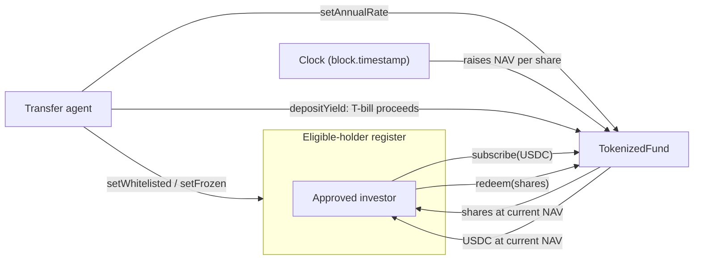

# Tokenized Money Market Fund

A money market fund issued as an ERC-20 token. Investors subscribe a stablecoin
and receive shares. The share price rises over time as the underlying T-bills
earn yield. Only addresses on an eligible-holder register may hold shares,
because the shares are a security.

Modelled on real tokenized funds — BlackRock's **BUIDL** and Franklin
Templeton's **FOBXX** — where a transfer agent maintains the holder register and
the blockchain acts as the official share register.

> **Testnet only.** Base Sepolia. Not a real fund, not audited, no real money.
> `MockUSDC` has an open faucet and must never reach mainnet.

## How it works



### Yield-bearing, not rebasing

Your **share count never changes**. The **price per share** goes up.

| | Day 0 | After 1 year at 5% |
|---|---|---|
| Shares held | 1,000 | 1,000 |
| NAV per share | $1.00 | $1.05 |
| Value | $1,000 | $1,050 |

The alternative design (rebasing) pins the price at $1.00 and grows your balance
instead. Rebasing suits DAO treasuries and DeFi collateral that need a stable
unit of account. Yield-bearing suits investors focused on accumulation, and the
accounting is cleaner to reason about and to test.

### NAV accrual

NAV per share is derived from the clock, not set by hand:

```
navPerShare = checkpoint + (checkpoint × annualRate × secondsElapsed ÷ secondsPerYear)
```

Simple interest, not compounding — real money market funds accrue daily on a
simple basis, and it keeps the arithmetic checkable by hand.

Changing the rate accrues first, so a new rate can never rewrite yield already
earned.

### A rising NAV has to be funded

This is the part that is easy to get wrong. A NAV that climbs on its own is only
a promise: the contract would owe redeemers more than it actually holds, and
late redeemers could not exit at all.

`depositYield` is how the manager pays the interest in, mirroring T-bill coupon
proceeds settling in a real fund. `isFullyBacked()` reports whether the promise
is currently covered.

There is a test for the failure case, not just the happy path.

### Compliance

Fund shares are a security, so transfers are restricted.

| Control | Effect |
|---|---|
| `setWhitelisted` | Adds or removes an address from the eligible-holder register |
| `setFrozen` | Blocks an account from sending, receiving, or redeeming, without striking it off |
| `forceTransfer` | Moves shares without the holder's consent — court orders, lost keys, inheritance |

`forceTransfer` is the transfer agent power. It looks wrong until you realise
every real fund needs it. It still refuses an ineligible destination, so shares
can never be forced onto an unapproved address.

Every mint, burn, and transfer passes through a single gate — the `_update` hook
that OpenZeppelin v5 introduced in place of `_beforeTokenTransfer`.

**Scope choice:** this is a single mapping rather than a full
[ERC-3643](https://www.erc3643.org) implementation. It captures the concept —
transfer restriction on a security — without the weight of the whole standard.
A deliberate simplification, not an oversight.

## Contracts

| File | Purpose |
|---|---|
| `src/TokenizedFund.sol` | The fund: ERC-20 shares, NAV accrual, compliance |
| `src/MockUSDC.sol` | Stand-in stablecoin for testing. 6 decimals, open faucet |
| `script/Deploy.s.sol` | Deploys both and seeds the deployer |
| `test/TokenizedFund.t.sol` | 24 tests |

### Decimals

Shares use **6 decimals**, matching USDC, so subscribe and redeem need no
rescaling. NAV per share is tracked separately as **18-decimal fixed point**,
where `1e18` represents exactly $1.00.

## Running it

Requires [Foundry](https://book.getfoundry.sh).

```bash
git clone https://github.com/cleairx/Project-Blockchain
cd Project-Blockchain

forge install foundry-rs/forge-std
forge install OpenZeppelin/openzeppelin-contracts@v5.7.0

forge build
forge test -vv
```

### Deploying to Base Sepolia

```bash
cp .env.example .env    # then fill in your testnet private key
source .env

forge script script/Deploy.s.sol:Deploy \
  --rpc-url base_sepolia \
  --broadcast \
  --verify
```

Get testnet ETH from the [Base Sepolia faucet](https://docs.base.org/chain/network-faucets).

**Deployed address:** _not yet deployed_

## Glossary

- **NAV** — Net Asset Value. Total fund value divided by shares outstanding.
- **Subscribe** — Deposit assets, receive newly issued shares.
- **Redeem** — Return shares, receive assets back.
- **Transfer agent** — The entity maintaining the official shareholder register
  and controlling who is allowed to hold shares.
- **Basis point (bps)** — One hundredth of a percent. 500 bps = 5.00%.
- **ERC-20** — The standard interface every fungible token on Ethereum follows.

## Licence

MIT
