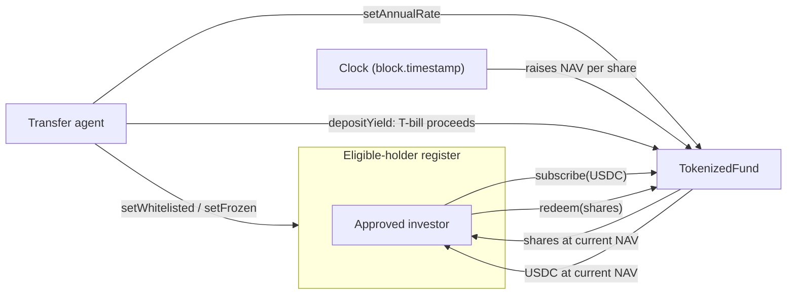

# Tokenized Money Market Fund

A money market fund issued as an ERC-20 token. Investors subscribe a stablecoin
and receive shares. The share price rises over time as the underlying T-bills
earn yield. Only addresses on an eligible-holder register may hold shares,
because the shares are a security.

Modelled on real tokenized funds — BlackRock's **BUIDL** and Franklin
Templeton's **FOBXX** — where a transfer agent maintains the holder register and
the blockchain acts as the official share register.

> **Testnet only.** Base Sepolia. Not a real fund, not audited, no real money.
> `MockUSDC` has an open faucet and must never reach mainnet.

## How it works



### Yield-bearing, not rebasing

Your **share count never changes**. The **price per share** goes up.

| | Day 0 | After 1 year at 5% |
|---|---|---|
| Shares held | 1,000 | 1,000 |
| NAV per share | $1.00 | $1.05 |
| Value | $1,000 | $1,050 |

The alternative design (rebasing) pins the price at $1.00 and grows your balance
instead. Rebasing suits DAO treasuries and DeFi collateral that need a stable
unit of account. Yield-bearing suits investors focused on accumulation, and the
accounting is cleaner to reason about and to test.

### NAV accrual

NAV per share is derived from the clock, not set by hand:

```
navPerShare = checkpoint + (checkpoint × annualRate × secondsElapsed ÷ secondsPerYear)
```

Simple interest, not compounding — real money market funds accrue daily on a
simple basis, and it keeps the arithmetic checkable by hand.

Changing the rate accrues first, so a new rate can never rewrite yield already
earned.

### A rising NAV has to be funded

This is the part that is easy to get wrong. A NAV that climbs on its own is only
a promise: the contract would owe redeemers more than it actually holds, and
late redeemers could not exit at all.

`depositYield` is how the manager pays the interest in, mirroring T-bill coupon
proceeds settling in a real fund. `isFullyBacked()` reports whether the promise
is currently covered.

There is a test for the failure case, not just the happy path.

### Compliance

Fund shares are a security, so transfers are restricted.

| Control | Effect |
|---|---|
| `setWhitelisted` | Adds or removes an address from the eligible-holder register |
| `setFrozen` | Blocks an account from sending, receiving, or redeeming, without striking it off |
| `forceTransfer` | Moves shares without the holder's consent — court orders, lost keys, inheritance |

`forceTransfer` is the transfer agent power. It looks wrong until you realise
every real fund needs it. It still refuses an ineligible destination, so shares
can never be forced onto an unapproved address.

Every mint, burn, and transfer passes through a single gate — the `_update` hook
that OpenZeppelin v5 introduced in place of `_beforeTokenTransfer`.

**Scope choice:** this is a single mapping rather than a full
[ERC-3643](https://www.erc3643.org) implementation. It captures the concept —
transfer restriction on a security — without the weight of the whole standard.
A deliberate simplification, not an oversight.

## Website

`docs/` holds a single-page site for **Carry**, the treasury product this fund was
built for. It is not a mockup: the hero reads `navPerShareCheckpoint`,
`lastAccrualTime` and `annualRateBps` from the deployed contract and reproduces
the accrual formula in the browser, so the share price ticks upward once a
second. The fund panel reads live AUM, backing status and supply, and a
connected wallet can subscribe and redeem against Sepolia.

An address that is not on the holder register sees the compliance layer refuse
it, which is the clearest demonstration of what this contract actually does.

Static HTML, no build step.

## Post mortem

Carry is presented on its own site the way any seed-stage company presents
itself. This section is the honest version, and it belongs in the repository
rather than on the product page.

**The product was built before the customer was understood.** A US startup can
already sweep idle cash into Treasuries at Mercury or Meow in about four clicks:
no wallet, no gas, and no counterparty the founder has to justify to their
board. Carry paid the same yield with none of that convenience, and asked for
more trust in exchange.

**The compliance layer made it worse rather than better.** Because fund shares
are a security, holders have to be approved, and that approval is the whole
business. It needs a transfer agent, a broker dealer relationship, and a
regulator who already knows your name. This was software written for a problem
whose real bottleneck was a licence.

**What survives is the engineering.** The accrual is correct to the second, the
register is enforced at the token level rather than by policy, and the contract
refuses to issue a share that nobody paid for. The `forceTransfer` bug found
before deployment is the clearest example: the transfer agent could have minted
unbacked shares through `address(0)`, and closing that hole is what separates a
demonstration from a toy.

**What would change next time:** speak to eight founders about where their cash
actually sits, before writing a line of Solidity.

One note on scope: the 0.15% management fee quoted on the site is the stated
business model, not something the contract charges. Fee accrual was left out
deliberately, and is tracked as an open question below.

## Contracts

| File | Purpose |
|---|---|
| `src/TokenizedFund.sol` | The fund: ERC-20 shares, NAV accrual, compliance |
| `src/MockUSDC.sol` | Stand-in stablecoin for testing. 6 decimals, open faucet |
| `script/Deploy.s.sol` | Deploys both and seeds the deployer |
| `test/TokenizedFund.t.sol` | 27 tests |

### Decimals

Shares use **6 decimals**, matching USDC, so subscribe and redeem need no
rescaling. NAV per share is tracked separately as **18-decimal fixed point**,
where `1e18` represents exactly $1.00.

## Running it

Requires [Foundry](https://book.getfoundry.sh).

```bash
git clone https://github.com/cleairx/Project-Blockchain
cd Project-Blockchain

forge install foundry-rs/forge-std
forge install OpenZeppelin/openzeppelin-contracts@v5.7.0

forge build
forge test -vv
```

### Deploying to a testnet

Deploys to **Ethereum Sepolia** by default — BUIDL and FOBXX are Ethereum
products, so it is the closer analogue. Swap `sepolia` for `base_sepolia` to
target Base instead; the contracts are identical.

```bash
cp .env.example .env    # then fill in your testnet private key
source .env

forge script script/Deploy.s.sol:Deploy \
  --rpc-url sepolia \
  --broadcast \
  --verify
```

Test ETH for gas comes from the
[Google Cloud Sepolia faucet](https://cloud.google.com/application/web3/faucet/ethereum/sepolia).
No test USDC is needed — `MockUSDC` mints its own.

### Live on Ethereum Sepolia

| Contract | Address |
|---|---|
| `TokenizedFund` | [`0xd1f36EE39eAAC22E42aE9365300D24f07c515C87`](https://sepolia.etherscan.io/address/0xd1f36EE39eAAC22E42aE9365300D24f07c515C87) |
| `MockUSDC` | [`0x941B691563DF3114368d41498d9e669e10ACCC8b`](https://sepolia.etherscan.io/address/0x941B691563DF3114368d41498d9e669e10ACCC8b) |

Deployed at block 11695166, opening at $1.00 per share with a 500 bps
(5.00%) annual rate.

#### Live accrual, observed on-chain

A subscription of **1,000.000000 mUSDC**, made roughly 14 minutes after
deployment, minted **999.998668 shares** — not 1,000.

| | |
|---|---|
| Deposited | 1,000.000000 mUSDC |
| Shares received | 999.998668 |
| Implied NAV per share | $1.00000133 |

The 0.001332 share shortfall is the yield that accrued between deployment and
subscription: 5% a year, prorated over ~14 minutes, priced off the chain's own
clock. Nothing was simulated and no admin pressed anything. The investor simply
bought in at a price that had already moved.

## Glossary

- **NAV** — Net Asset Value. Total fund value divided by shares outstanding.
- **Subscribe** — Deposit assets, receive newly issued shares.
- **Redeem** — Return shares, receive assets back.
- **Transfer agent** — The entity maintaining the official shareholder register
  and controlling who is allowed to hold shares.
- **Basis point (bps)** — One hundredth of a percent. 500 bps = 5.00%.
- **ERC-20** — The standard interface every fungible token on Ethereum follows.

## Licence

MIT
